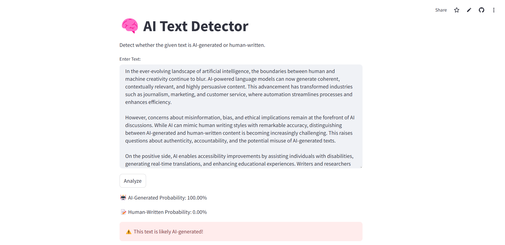

# 🧠 AI Text Detector

## 📌 Description
AI Text Detector is a Streamlit-based web application that detects whether a given text is AI-generated or human-written. This project uses a fine-tuned BERT model trained on the [LLM Detect AI Generated Text Dataset](https://www.kaggle.com/datasets/sunilthite/llm-detect-ai-generated-text-dataset).

## 🚀 Live Demo
You can access the deployed application here:
👉 [AI Text Detector](https://aigenerateddetector.streamlit.app/)

## 🖼️ Screenshot

## 📚 Fine-Tuned Model
This project leverages a fine-tuned BERT model, which can be accessed on Hugging Face:
👉 [Fine-Tuned Model on Hugging Face]()

### For any query contact me tusharposwal552@gmail.com
